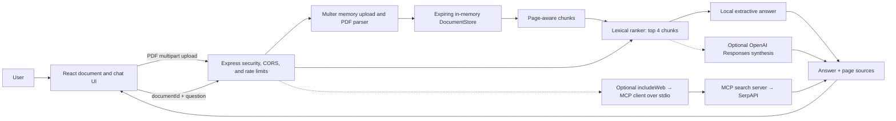
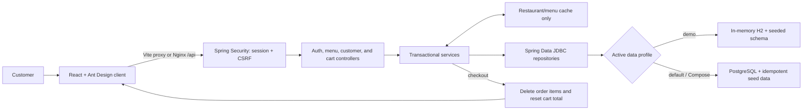
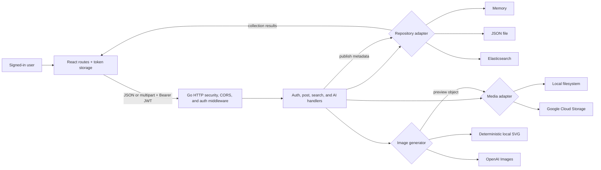
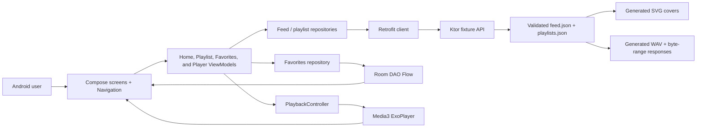

# Full-Stack Application Suite

This repo contains four independently runnable applications. Each project owns its runtime, tests, documentation, and local development workflow, with credential-free defaults for core functionality.

| Project | Product | Primary stack | Credential-free local path |
| --- | --- | --- | --- |
| [Agent AI](./agent-ai/README.md) | PDF-grounded question answering with optional web comparison | Node.js 22, Express 5, React 19, Vite, MCP | Extractive local retrieval and answers |
| [OnlineOrder](./onlineorder/README.md) | Secure restaurant browsing, cart, and checkout | Java 21, Spring Boot 3, PostgreSQL, React 18, Ant Design | In-memory H2 demo profile; PostgreSQL through Compose |
| [SocialAI](./socialai/README.md) | Authenticated media collection with AI image generation | Go, React 18, Vite, pluggable storage/search/AI adapters | JSON persistence, local media, generated SVG previews |
| [Spotify Local](./spotify/README.md) | Native album, favorites, and music-playback experience | Kotlin, Ktor, Android Compose, Hilt, Retrofit, Room, Media3 | Generated local covers and royalty-free WAV fixtures |

## Application walkthroughs

The first three walkthroughs were recorded from live local builds and follow the real application paths. Spotify's walkthrough is rendered from the checked-in fixtures and the app's Compose state because it requires an Android runtime; the animation labels this explicitly and does not present itself as emulator footage.

<table>
  <tr>
    <td width="50%">
      <a href="./agent-ai/README.md"></a><br>
      <strong>Agent AI</strong><br>
      <sub>Upload a real PDF → ask a grounded question → expand the matching page source.</sub>
    </td>
    <td width="50%">
      <a href="./onlineorder/README.md"></a><br>
      <strong>OnlineOrder / Lai Food</strong><br>
      <sub>Sign in → browse the seeded menu → aggregate quantity and total → check out.</sub>
    </td>
  </tr>
  <tr>
    <td width="50%">
      <a href="./socialai/README.md"></a><br>
      <strong>SocialAI</strong><br>
      <sub>Generate with the local AI adapter → publish → browse and open the collection item.</sub>
    </td>
    <td width="50%">
      <a href="./spotify/README.md"></a><br>
      <strong>Spotify Local</strong><br>
      <sub>Source-driven Compose walkthrough: Home → playlist → playback and favorite → Favorites.</sub>
    </td>
  </tr>
</table>

Static poster frames are stored beside the animations in [`docs/assets/demos`](./docs/assets/demos/).

## System flow charts

These charts follow the concrete request, storage, and playback paths implemented in each project.

### Agent AI



### OnlineOrder / Lai Food



### SocialAI



### Spotify Local



## Repository layout

```text
full-stack-projects/
├── README.md                  Monorepo overview and verification guide
├── .github/workflows/         Application CI with monorepo paths
├── docs/assets/demos/         README animations and static poster frames
├── agent-ai/
│   ├── client/                React/Vite browser app
│   ├── server/                Express API, retrieval, PDF, MCP, and evaluation
│   ├── pnpm-lock.yaml         Shared workspace dependency lock
│   └── docker-compose.yml     Nginx web + API stack
├── onlineorder/
│   ├── backend/               Spring Boot/Gradle API
│   ├── frontend/              React/Vite/Ant Design client
│   └── docker-compose.yml     PostgreSQL + API + Nginx web stack
├── socialai/
│   ├── backend/               Go API and adapter implementations
│   ├── web/                   React/Vite client
│   ├── data/ and media/       Ignored local persistence locations
│   └── docker-compose.yml     API + Nginx web stack
└── spotify/
    ├── backend/               Independent Ktor/Gradle API
    ├── android/               Independent Android/Gradle application
    ├── scripts/               Fixture smoke and offline structure checks
    └── compose.yaml           Containerized Ktor API
```

There is intentionally no shared application runtime or root dependency graph. Each project owns its lockfile, Gradle wrapper, environment template, tests, and deployment files. That keeps builds reproducible and lets developers work on one project without installing the other stacks.

The root README is the repository landing page, while each application keeps its own dependency graph, lockfiles, environment template, tests, deployment files, and subtree-specific ignore rules.

Several services default to port `8080`—OnlineOrder, SocialAI, and Spotify's backend—so run them one at a time or change their documented port settings. Agent AI uses API port `5001` by default.

## Project highlights

### Agent AI

Agent AI is a local-first retrieval-augmented generation application. A user uploads a real PDF, receives an opaque expiring document session, asks questions, and sees page-aware source excerpts with each grounded answer. The responsive React interface includes drag-and-drop upload, conversation history, dictation, speech playback, keyboard operation, and user-facing error states.

The Express API performs PDF validation and extraction, deterministic passage ranking, bounded uploads and questions, rate limiting, CORS allowlisting, and in-memory session expiry with periodic removal. Local mode needs no credentials. Optional provider boundaries add OpenAI Responses synthesis and an MCP stdio child server backed by SerpAPI without exposing keys to the browser.

Key capabilities:

- real document ingestion and source provenance rather than canned chat responses;
- a testable local fallback around optional AI and search providers;
- per-document isolation instead of a process-global upload path;
- security headers, origin controls, limits, expiry, and early deletion;
- containerized Nginx frontend and private API routing.

### OnlineOrder / Lai Food

OnlineOrder is a transactional full-stack food-ordering application. Customers can register, sign in, browse seeded restaurants and menus, add quantities to a personal cart, see precise decimal totals, and complete a demo checkout. Checkout atomically clears the active cart; payment processing and a persisted order ledger are outside this project's scope. PostgreSQL schema constraints and indexes enforce the domain model, while idempotent seed scripts make repeated local starts safe.

The Java 21 backend uses Spring Boot Web, Security, Data JDBC, Validation, Actuator, Caffeine, BCrypt, server-side sessions, and CSRF protection. The React 18/Ant Design client handles authentication, menu browsing, cart interactions, loading, and failures. Docker Compose connects PostgreSQL, a non-root API image, and an Nginx frontend.

Key capabilities:

- session fixation protection and CSRF on state-changing browser requests;
- passwords in request bodies and BCrypt hashes at rest;
- authenticated, per-customer cart snapshots read directly at repeatable-read isolation; restaurant/menu data remains cacheable;
- H2-backed service and HTTP integration tests independent of Docker;
- production JAR and frontend bundle verification.

### SocialAI

SocialAI is an authenticated media-sharing application. Users can register, sign in, upload images or videos, search by creator and all caption terms, delete only their own posts, generate an AI image preview, discard it, or publish it into the collection.

The Go backend deliberately uses the standard library and interfaces around three replaceable boundaries: repository (`memory`, JSON file, or Elasticsearch), media (`local` or Google Cloud Storage), and image generation (local SVG or OpenAI). The React app provides register, login, creation, generation, publishing, and collection flows. Local defaults need no cloud account.

Key capabilities:

- PBKDF2 password hashing and strictly validated, expiring HS256 tokens;
- upload size/type validation, storage traversal protection, CORS, and ownership checks;
- race-tested repository and HTTP behavior;
- optional Elasticsearch, GCS, and OpenAI adapters behind local implementations;
- a local registration-to-publishing browser flow, with current behavior checked by tests and CI rather than inferred from the historical demo recording.

### Spotify Local

Spotify Local pairs a Ktor fixture API with a native Android application. The app presents feed sections, navigates to playlist details, persists favorite albums in Room, and controls Media3/ExoPlayer through an activity-scoped floating player with play, pause, progress, and seek behavior.

The Android client uses Compose, MVVM, `StateFlow`, Hilt, Retrofit, Navigation Compose, Room, Coil, and a playback interface that can be replaced in unit tests. The Ktor server preserves the documented feed/playlist/song contracts while generating deterministic SVG covers and five-second WAV tracks at request time, avoiding copyrighted binaries and external media hosting.

Key capabilities:

- API, repository, database, ViewModel, navigation, and playback separation;
- local favorites that survive process restarts;
- shared playback UI across Home, Favorites, and Playlist destinations;
- Android CI tasks for debug/test APK assembly, Hilt/Room code generation, lint, and emulator instrumentation;
- credential-free, referentially validated sample media.

## Testing and verification

Root workflows in [`.github/workflows`](./.github/workflows) run each application's locked install, tests, and build on relevant changes. Agent AI adds retrieval evaluation and dependency audit; OnlineOrder runs a real PostgreSQL service; SocialAI uses the race detector and HTTP contract fakes; Spotify builds/lints Android and runs device instrumentation on an emulator. Workflow artifacts hold test reports and Android packages. Check the run for the exact commit: configuration alone is not a passing CI result.

| Application | Local verification on 2026-10-06 | Separate integration boundary |
| --- | --- | --- |
| Agent AI | 26 Node tests + 6 React tests; production build; ten-question synthetic PDF retrieval evaluation; dependency audit passed after updates | OpenAI and SerpAPI success/error contracts use injected fakes; no paid live provider calls |
| OnlineOrder | 16 regular Java tests + 3 real PostgreSQL integration tests; JAR build | PostgreSQL tests require a disposable database; checkout is a cart reset, not payment/order history |
| SocialAI | Go tests pass with race detection and vet, including GCS/Elasticsearch HTTP contracts and publish/discard retries | Fakes verify request/response behavior, not live cloud IAM, bucket ACLs, or Elasticsearch deployment |
| Spotify Local | 7 Ktor tests and offline fixture validation | Local Android SDK unavailable during this verification; build, six JVM tests, and four device tests are assigned to Android CI and must be checked in its run |

The previous July snapshot reported 84 tests. Added regressions and distinct integration tasks make that frozen total obsolete; use individual suite output and CI artifacts. A compiled test APK is not an executed device test. The source-rendered Spotify walkthrough remains explicitly labeled and is not runtime evidence.

```bash
# Node.js 24 + pnpm 11
cd agent-ai
pnpm install --frozen-lockfile
pnpm test
pnpm check
pnpm eval
pnpm audit --audit-level high

# JDK 21; regular tests do not require PostgreSQL
cd ../onlineorder/backend
./gradlew test bootJar
# For a disposable PostgreSQL database, set POSTGRES_TEST_URL,
# POSTGRES_TEST_USER, and POSTGRES_TEST_PASSWORD, then:
./gradlew postgresTest

cd ../frontend
pnpm install --frozen-lockfile
pnpm test
pnpm build
pnpm audit --audit-level high

cd ../../socialai/backend
go test -race ./... -count=1
go vet ./...
go build ./cmd/server
cd ../web
pnpm install --frozen-lockfile
pnpm test
pnpm build
pnpm audit --audit-level high

cd ../../spotify/backend
./gradlew test
cd ..
python3 scripts/validate-project.py
cd android
./gradlew testDebugUnitTest assembleDebug lintDebug assembleDebugAndroidTest
# Requires an Android emulator/device:
./gradlew connectedDebugAndroidTest
```

See [engineering decisions and evidence boundaries](./docs/engineering-decisions.md) and each application README for rationale, prerequisites, and limitations.

## Repository hygiene

The source-level audit found no credentials or private keys in the project trees:

- There are no real `.env`, keystore, PEM, service-account, or local Android property files under the four project trees.
- Every `.env.example` contains blank credential fields or safe localhost values only.
- Agent AI's upload directory, and SocialAI's data/media directories, contain only `.gitkeep`; no user uploads or persisted records were found.
- OpenAI, SerpAPI, PostgreSQL, JWT, Elasticsearch, and cloud credential values remain external configuration.
- Gradle Wrapper JARs, pnpm lockfiles, the root CI workflows, and Spotify's exported Room schema are intentional source artifacts.
- Java, Go, Node.js, and Android toolchains are external prerequisites and are not committed to the repository.

Generated dependencies, build products, Gradle caches, local SDKs, and verification binaries are excluded from version control:

| Project | Tracked generated material | Repository policy |
| --- | --- | --- |
| Agent AI | None | Ignore rules cover future `node_modules` and `dist` output |
| OnlineOrder | None | Ignore rules cover future frontend and Gradle output |
| SocialAI | None | Local `data`/`media` payloads and web output remain ignored |
| Spotify | None | Ignore rules cover Android SDK metadata, build output, and Gradle/Kotlin caches |

The applications share one repository for discovery while remaining independently buildable and runnable.

## Running the projects

Start with the individual project README linked in the table above. Each contains its exact prerequisites, configuration, API contract, direct-development commands, Docker option, security notes, and troubleshooting guidance.

For a clean review workflow:

1. Choose one project and copy its `.env.example` to `.env` only when its local instructions require it.
2. Install dependencies from its checked-in lockfile or use its Gradle wrapper.
3. Run that project's verified test commands before starting services.
4. Use its local, credential-free adapters first.
5. Enable paid/cloud adapters only with scoped credentials stored outside source control.

The applications are independent projects rather than microservices that depend on one another.
