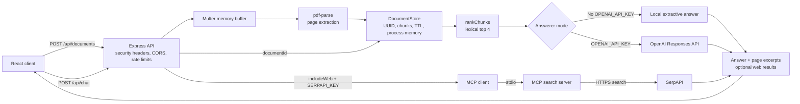

# Agent AI

Agent AI is a local-first PDF question-answering application built with Express, React, retrieval-augmented generation, voice input/output, and the Model Context Protocol. It accepts a PDF, retrieves relevant passages for each question, and can optionally compare the grounded answer with live web results supplied by a child-process MCP server.

The application works without paid credentials: local mode ranks document passages and produces an extractive answer. Add OpenAI and SerpAPI keys to enable model-written answers and MCP-backed web research.

## Product tour


This is a live local run of the credential-free path: a real two-page PDF is parsed, the refund and support question is answered from its text, and the page-two evidence is expanded. A [static poster frame](../docs/assets/demos/agent-ai-poster.png) is also available.

## What is included

- React 19 + Vite responsive UI with drag-and-drop upload, conversation history, source excerpts, dictation, speech playback, and keyboard/accessibility support
- Express 5 API with in-memory, expiring document sessions (no shared global upload path)
- real PDF text extraction and page-labeled source excerpts
- deterministic local retrieval and answer fallback
- optional OpenAI Responses API synthesis, configured with `OPENAI_API_KEY`
- optional MCP stdio server/client pair for SerpAPI search, configured with `SERPAPI_KEY`
- upload limits, PDF content checks, origin allowlist, rate limiting, security headers, and bounded input
- unit, API integration, real-PDF parsing, and React interaction tests
- Docker images and Compose configuration

## Architecture



Uploaded text lives only in process memory. Access expires at `DOCUMENT_TTL_MS`; periodic cleanup removes idle records on the next sweep (at most 60 seconds later while the event loop is responsive). Restart and graceful shutdown clear the store. Replacing a document aborts outstanding browser requests and requests early deletion; a response that arrives after replacement is discarded. IDs are unguessable bearer capabilities, not authenticated user accounts: anyone holding an ID can query or delete that session.

## Requirements

- Node.js 22 or newer
- pnpm 11 (Corepack can provide it)
- optional: Docker with Compose

## Run locally

```bash
corepack enable
pnpm install --frozen-lockfile
cp .env.example .env
pnpm dev
```

Open <http://localhost:5173>. The API listens on <http://localhost:5001>.

Local mode needs no API keys. To enable live features, edit `.env`:

```dotenv
OPENAI_API_KEY=your_key
OPENAI_MODEL=gpt-5
SERPAPI_KEY=your_key
```

The model is a configuration value so it can be pinned or upgraded independently. The prompt is kept in source and covered by the provider boundary, which makes it reviewable and testable.

## Test and build

```bash
pnpm test
pnpm check
pnpm build
pnpm eval
pnpm audit --audit-level high
```

`pnpm test` covers retrieval, scheduled retention cleanup, actual PDF extraction, upload/chat/delete, CORS, replacement races, and successful/failing provider contracts through local fakes. No provider credentials are needed. `pnpm eval` parses a checked-in fictional CC0 PDF and reports page-retrieval metrics; see [evaluation scope and labels](./server/eval/README.md). It is a regression smoke evaluation, not evidence of general model answer quality.

Conversation history is displayed in the current browser session; the API receives each question independently. Source excerpts have page labels but do not open an embedded PDF viewer. Page/text limits are checked after parsing and do not enforce a hard parser CPU or memory budget.

## Docker

```bash
cp .env.example .env
docker compose up --build
```

Open <http://localhost:8080>. The Nginx container serves the built UI and proxies `/api` to the server container.
The API container is intentionally reachable only through that proxy so forwarded client addresses cannot be spoofed through a second public port.

## API

### Upload

```bash
curl -F 'file=@guide.pdf;type=application/pdf' http://localhost:5001/api/documents
```

The response includes a `documentId`; send that opaque ID with each question.

### Ask

```bash
curl -X POST http://localhost:5001/api/chat \
  -H 'content-type: application/json' \
  -d '{"documentId":"<id>","question":"What is the central argument?","includeWeb":false}'
```

The response contains `ragAnswer`, page-aware `sources`, optional `mcpAnswer`, and optional `webSources`. Legacy routes `/upload` and `/chat` remain available as compatibility aliases, though the versioned JSON API is preferred.

### Delete early

```bash
curl -X DELETE http://localhost:5001/api/documents/<id>
```

## Production notes

The in-memory store is deliberate for a zero-dependency local demo. For multiple server instances, replace `DocumentStore` with an encrypted object store plus a shared vector/search index, add authenticated per-user ownership, and use a distributed rate limiter. Keep keys in the deployment platform's secret manager. Do not upload confidential or regulated material until retention, access control, deletion, logging, and provider data-handling requirements have been reviewed.
