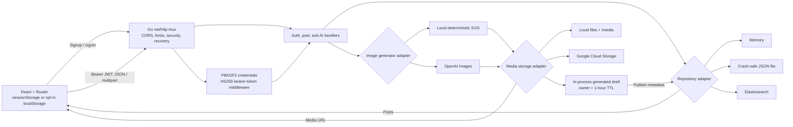

# SocialAI

SocialAI is a Go + React social-media application. Users can register, sign in, upload images or videos, search posts by creator or all caption terms, delete their own posts, generate an AI image, and publish that image to the collection.

It works locally without any cloud account: JSON-file persistence, local media storage, and an SVG-based AI preview are the defaults. Elasticsearch, Google Cloud Storage, and OpenAI Images are selectable production adapters.

## Product tour


This is a live local run of the default adapters: the prompt produces a deterministic SVG preview, the preview is published through the real API, and the resulting post is opened from the collection. A [static poster frame](../docs/assets/demos/socialai-poster.png) is also available.

## Run locally

Prerequisites: Go 1.22+, Node 20+, and pnpm 9+.

```bash
cp .env.example .env
# Replace JWT_SECRET in .env with: openssl rand -base64 48
cd web && pnpm install && cd ..
./scripts/dev.sh
```

Open <http://localhost:5173>. The API listens at <http://localhost:8080>. Uploaded media and repository data are written to the ignored `media/` and `data/` directories.

The local AI adapter produces an attractive SVG preview and exercises the exact same generate → preview → publish path as OpenAI. Set `AI_IMAGE_BACKEND=openai` and `OPENAI_API_KEY` to use the real service; the key is read only by the Go server and is never bundled into JavaScript.

### Docker

```bash
cp .env.example .env
# Set a fresh JWT_SECRET in .env, then:
docker compose up --build
```

Open <http://localhost:3000>. Compose persists repository data and media in Docker named volumes. The backend is reachable through the web proxy rather than exposed directly, so proxy-derived client addresses cannot be spoofed from the public network.

Remove the containers and persisted development data with `docker compose down --volumes`.

## Test and build

```bash
cd backend
go test ./...
go vet ./...

cd ../web
pnpm test
pnpm build
```

Backend tests cover password hashing, token tamper/expiry checks, both local repositories, storage traversal protection, CORS, authentication, upload/media validation, AND-keyword search, cross-user delete protection, owner deletion, local AI generation, and AI publishing. Frontend tests cover API authentication/errors, sign-in routing/session storage, generation, and publishing.

## Architecture



The Go packages are organized around interfaces rather than cloud globals, so tests use in-memory/local adapters and production services remain optional. The backend uses only the Go standard library.

### Security decisions

- Passwords use salted PBKDF2-HMAC-SHA256 with 310,000 iterations; plaintext passwords are never stored.
- JWTs are HS256 signed, expire, validate algorithm/issuer/signature, and require a random 32+ character production secret.
- The client defaults to session storage. “Keep me signed in” explicitly opts into local storage.
- Sign-in is rate limited and errors do not disclose whether an account exists.
- JSON uses strict decoding and size limits; uploads are capped and accepted by detected content, not filename extension.
- Delete checks ownership in the repository. Browser CORS origins are allowlisted.
- OpenAI and cloud credentials stay server-side. `.env`, data, media, build output, and local tools are ignored.
- Temporary image downloads accept HTTPS only, bypass ambient proxies, pin DNS to public addresses, revalidate redirects, and verify raster-image signatures.

For internet deployment, terminate TLS at a trusted proxy, set `APP_ENV=production`, use an independently generated `JWT_SECRET`, allow only the real frontend origin, and store secrets in the platform secret manager rather than an environment file committed to Git.

## Configuration

All settings and safe development defaults are documented in [`.env.example`](.env.example).

| Setting | Values / purpose |
| --- | --- |
| `REPOSITORY_BACKEND` | `memory`, `file` (default), or `elasticsearch` |
| `MEDIA_BACKEND` | `local` (default) or `gcs` |
| `AI_IMAGE_BACKEND` | `local` (default) or `openai` |
| `PUBLIC_URL` | Public backend/media origin used in post URLs |
| `CORS_ALLOWED_ORIGINS` | Comma-separated exact browser origins |
| `TRUST_PROXY` | Trust `X-Forwarded-For` only behind a proxy that overwrites it |
| `MAX_UPLOAD_BYTES` | Request cap; defaults to 25 MiB |
| `JWT_TTL` | Go duration such as `24h` |

### Elasticsearch

Set:

```dotenv
REPOSITORY_BACKEND=elasticsearch
ELASTICSEARCH_URL=https://your-elasticsearch:9200
ELASTICSEARCH_USERNAME=elastic
ELASTICSEARCH_PASSWORD=...
```

Startup creates `<prefix>-users` and `<prefix>-posts` if absent. The adapter works with the Elasticsearch 7/8 document/search HTTP APIs and supports basic authentication. Use TLS and a least-privilege service user in production.

### Google Cloud Storage

Set `MEDIA_BACKEND=gcs` and `GCS_BUCKET`. On GCE or App Engine, the adapter obtains the attached service account token from the metadata server. Elsewhere, `GCS_BEARER_TOKEN` can supply a short-lived OAuth access token. The service identity needs object create/delete permissions.

Post URLs use the bucket’s standard HTTPS object URL. Configure object viewing at the bucket/CDN layer if the collection is public; for a private product, replace public URLs with signed delivery URLs.

### OpenAI images

Set:

```dotenv
AI_IMAGE_BACKEND=openai
OPENAI_API_KEY=...
OPENAI_IMAGE_MODEL=gpt-image-2
```

The default is `gpt-image-2` and remains configurable for compatible models. The server accepts either bounded `b64_json` image data or a temporary HTTPS image URL from the configured endpoint, validates size and media type, stores the result through the selected media adapter, and returns only the stored URL to the browser.

Unpublished preview metadata is instance-local and expires after one hour; discarded and expired objects are removed from storage. Keep the generate → publish flow on one API replica (or extend the repository interface for shared draft state) when horizontally scaling the backend.

## API

All protected endpoints expect `Authorization: Bearer <token>`.

| Method | Endpoint | Purpose |
| --- | --- | --- |
| `POST` | `/api/auth/signup` | Create an account |
| `POST` | `/api/auth/signin` | Return `{ token, username }` |
| `GET` | `/api/posts?user=&keywords=` | Search newest posts; all keyword terms must match |
| `POST` | `/api/posts` | Multipart `message` + `media_file` upload |
| `DELETE` | `/api/posts/{id}` | Delete the signed-in user’s post |
| `POST` | `/api/ai/images` | Generate and store a preview from `{ prompt }` |
| `DELETE` | `/api/ai/images/{id}` | Discard the signed-in user’s unpublished preview |
| `POST` | `/api/ai/images/{id}/publish` | Publish preview with optional `{ message }` |
| `GET` | `/healthz` | Liveness check |

Legacy endpoints `/signup`, `/signin`, `/upload`, `/search`, and `/post/{id}` remain available as compatibility aliases. Responses use JSON; errors have the shape `{ "error": { "code": "...", "message": "..." } }`.


## Adapter contracts and lifecycle boundaries

The Go suite includes successful and failing HTTP contracts for Elasticsearch (mapping setup, write visibility, all-term search, ownership, throttling) and GCS (object encoding, upload/delete status, metadata-token caching/refresh), plus image-provider errors. These use local HTTP servers or injected transports with synthetic credentials. They do not validate live cloud permissions, bucket visibility, billing, or deployed service versions.

Publishing consumes a preview once; persistence failure restores it for retry. Failed discard also restores owner access so deletion can be retried. Regression tests cover these boundaries. Post metadata and media objects are separate stores, so there is no distributed transaction: failed compensating deletions can leave orphan objects. Preview metadata is process-local and expires lazily on generation/publish; restarting loses preview references while stored objects may remain. A production deployment needs durable preview records, bounded cleanup/reconciliation, and private-object access controls before promising durable retention/deletion guarantees.

Multipart temporary files are removed after upload handling. Generated previews and published URLs follow the configured storage backend's access policy; a GCS URL by itself does not grant read permission.
