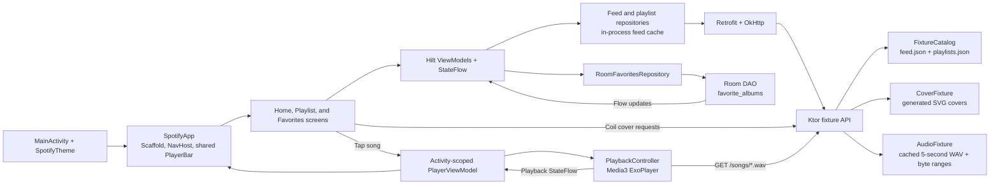

# Spotify Local — Ktor + Android

Spotify Local is a self-contained music application with a Kotlin/Ktor backend and a native Android client. It uses deterministic local fixtures in place of commercial APIs and copyrighted tracks.

The result has two independent Gradle projects:

- `backend/`: a Kotlin/Ktor API on port `8080`.
- `android/`: a native Android app using Compose, MVVM, Hilt, Retrofit, Room, Media3, and Navigation Compose.

No account, API key, subscription, database server, or paid service is required.

## Product tour


This animation is a deterministic, source-driven walkthrough rendered from the actual Compose states and checked-in feed/playlist fixtures. It documents the implemented Home → playlist → playback/favorite → Favorites path, but is intentionally labeled as a source rendering rather than emulator footage. A [static poster frame](../docs/assets/demos/spotify-poster.png) is also available.

## What works

- Home presents album sections from `GET /feed`.
- Tapping an album navigates to its `GET /playlist/{id}` detail.
- The heart saves/removes an album in a Room database.
- Favorites observes Room as a `Flow`, survives restarts, and links back to album detail.
- Tapping a song loads and plays it through Media3/ExoPlayer.
- A shared floating player remains above bottom navigation, with play/pause, progress, seeking, art, and playback errors.
- The Ktor server caches generated five-second WAV tones and generates SVG album covers for catalog entries. Audio supports bounded byte-range requests for Media3 seeking. Both media routes send cache headers; fixtures are royalty-free, deterministic, and require no binary media checkout.
- Loading, empty, network-error, bad-id, and playback-error states are represented.

## Architecture



Important Android packages:

- `data/model`: documented `Album`, `Section`, `Playlist`, and `Song` shapes.
- `data/remote`: Retrofit suspend API.
- `data/local`: Room entity, DAO, database, and mapping.
- `data/repository`: network/cache and favorites abstractions.
- `di`: Hilt bindings for Retrofit, Room, repositories, and ExoPlayer.
- `ui/home`, `ui/playlist`, `ui/favorites`: state holders and Compose screens.
- `player` and `ui/player`: testable playback boundary, Media3 implementation, and floating player.
- `ui/navigation`: activity-level player plus Home/Favorites/Playlist navigation.

The application registers `SvgDecoder.Factory()` on its shared Coil 2 image loader; adding the SVG dependency alone does not register the decoder in that version. A device test resolves the application loader and decodes an SVG.

The playback boundary is deliberately an interface. Unit tests can drive `PlayerViewModel` without constructing an Android `ExoPlayer`; production still uses the Hilt-provided Media3 implementation.

## Prerequisites

- JDK 17 (the Gradle wrapper downloads Gradle 8.10.2).
- For Android: Android Studio with Android SDK 35, Build Tools, and an API 35 emulator/device.
- Optional: Docker with Compose, if you prefer not to install a JDK for the backend.

## Start the backend

From this directory:

```bash
cd backend
PUBLIC_BASE_URL=http://10.0.2.2:8080 ./gradlew run
```

`10.0.2.2` is the Android Emulator alias for the development computer. The server itself listens on all interfaces at port `8080`. Check it from the host with:

```bash
curl http://127.0.0.1:8080/health
../scripts/check-fixtures.sh
```

Or use Docker:

```bash
docker compose up --build api
```

## Run the Android app

1. Start the backend and keep it running.
2. Open `android/` in Android Studio and let Gradle sync.
3. Start an Android emulator.
4. Run the `app` debug configuration.

The debug build defaults to `http://10.0.2.2:8080/` and permits cleartext traffic for local development only. Release builds do not opt into cleartext traffic.

To use a physical device, put the computer and device on the same network, allow inbound port `8080`, then build with the computer's LAN address. Both values are needed because the API returns absolute cover/audio URLs:

```bash
cd backend
PUBLIC_BASE_URL=http://192.168.1.100:8080 ./gradlew run

cd ../android
./gradlew -PSPOTIFY_API_BASE_URL=http://192.168.1.100:8080/ installDebug
```

The Gradle URL must end with `/`. See `.env.example` for the same settings.

## API contract

| Method | Route | Result |
|---|---|---|
| `GET` | `/` | Plain-text service name |
| `GET` | `/health` | Fixture counts and status |
| `GET` | `/feed` | `List<Section>` with nested albums |
| `GET` | `/playlists` | All playlists (the documented bulk endpoint) |
| `GET` | `/playlist/{id}` | One playlist or a JSON 400/404 error |
| `GET` | `/covers/{id}.svg` | Generated local cover |
| `GET` | `/songs/{name}.wav` | Generated local five-second audio fixture |

The original field names are preserved: `section_title`, `album`, `id`, `year`, `cover`, `artists`, `description`, and each song's `name`, `lyric`, `src`, and `length`. `PUBLIC_BASE_URL` only hydrates the relative media paths into URLs reachable from the client.

## Tests and verification

Backend route, serialization, error, fixture, cover, and audio checks:

```bash
cd backend
./gradlew test
```

Android Retrofit-contract, Home ViewModel, and Player ViewModel tests:

```bash
cd android
./gradlew testDebugUnitTest
```

Device instrumentation checks (requires a running emulator/device):

```bash
cd android
./gradlew connectedDebugAndroidTest
```

These execute Room save/remove and on-disk database reopen persistence, the actual application SVG loader, and real Media3 WAV playback/pause/seek. Database reopen is not a full operating-system process-restart test. The Media3 test uses a local WAV to keep device tests independent of a host server. Record a separate manual Ktor-to-Android navigation/playback run before claiming the complete app flow was exercised. The root Spotify workflow installs SDK 35 and runs these tests on an emulator; inspect that run's reports to establish execution.

Compile the complete debug app:

```bash
cd android
./gradlew assembleDebug
```

On a machine without Java/Android tooling, the offline validator still checks fixture referential integrity, exact API keys, local-media paths, XML parsing, required architecture seams, and wrapper integrity:

```bash
python3 scripts/validate-project.py
```

That validator complements the compiled tests; it is not a substitute for them.

## Local data and fixture behavior

Room stores only albums the user favorites. Feed and playlist content remains server-owned and the feed repository caches it in memory for the process lifetime. The server validates at startup that album and playlist IDs are unique, every album has one playlist, and every playlist contains songs.

Audio is intentionally short. `AudioFixture` synthesizes mono 16-bit PCM WAV bytes using a filename-derived frequency; `CoverFixture` emits a simple SVG from the album ID. This keeps clones small and demos repeatable.

## Troubleshooting

- **Android says connection refused:** confirm the backend is running, then open `http://10.0.2.2:8080/health` from the emulator browser. Never use `localhost` from the emulator for a host service.
- **A physical device cannot connect:** use the host LAN IP in both settings above and check the firewall. Debug builds allow local HTTP; production should use HTTPS.
- **Port 8080 is busy:** set `PORT` and update both public/client URLs to the same port.
- **Images load but tracks fail:** request one `src` URL from `/playlist/1` in the emulator browser. Media URLs are absolute and depend on `PUBLIC_BASE_URL`.
- **Room instrumentation test has no target:** boot an emulator first; local JVM tests do not require one.
- **SDK 35 is missing:** install it from Android Studio's SDK Manager, then retry Gradle sync.

## Deliberate boundaries

Playback runs while the application process is alive. Production-grade background playback would add a Media3 `MediaSessionService`, notification controls, audio-focus policy, and foreground-service declarations. Authentication, analytics, remote persistence, and copyrighted catalog ingestion are outside the current scope.
